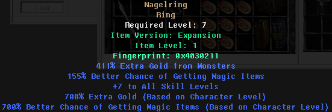
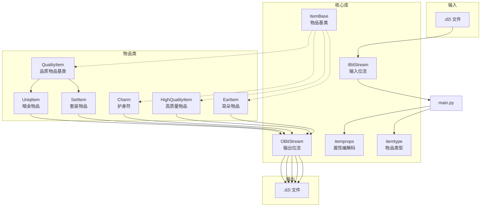

# D2Idol - Diablo II Item Maker

Diablo II 物品制作器，最初于 2008 年用 C++ 编写，最近用 Python 重写。



## 架构图



## 项目结构

```
d2idol/
├── lib/                    # 核心库
│   ├── itembase.py         # 物品基类
│   ├── uniqitem.py         # 暗金物品
│   ├── setitem.py          # 套装物品
│   ├── charm.py            # 护身符
│   ├── highquality_item.py # 高质量物品
│   ├── earitem.py          # 耳朵物品
│   ├── itemprops.py        # 物品属性
│   ├── itemtype.py         # 物品类型
│   ├── quality.py          # 品质定义
│   ├── obitstream.py       # 输出位流
│   └── ibitstream.py       # 输入位流
├── tests/                  # 单元测试
├── examples/               # 示例脚本
├── output/                 # 生成的物品文件
├── doc/                    # 文档
└── main.py                 # 解析器入口
```

## 快速开始

### 运行测试

```bash
make tests
# 或者
python3 -m unittest discover
```

### 运行示例

```bash
make examples
```

这将生成各种类型的物品到 `output/` 目录：
- `output/unique/` - 暗金物品
- `output/set/` - 套装物品
- `output/charm/` - 护身符
- `output/superior/` - 超强物品

### 清理输出

```bash
make clean
```

## 用法示例

### 创建暗金物品 (UniqItem)

```python
from lib import UniqItem, OBitStream

# 创建一个暗金戒指 (Nagelring)
s = OBitStream()
item = UniqItem("rin ", 0x78)  # 代码 "rin " = 戒指, ID 0x78

# 添加属性
item.addProp(127)           # +7 to All Skill Levels
item.addPropGroup("mf")     # 魔法寻找属性组
item.addPropGroup("greed")  # 金币获取属性组

# 写入文件
item.writeStream(s)
with open("ring.d2i", "wb") as f:
    s.writeBytes(f)
```

### 创建套装物品 (SetItem)

```python
from lib import SetItem, OBitStream

s = OBitStream()
item = SetItem("urn ", 0x51)  # Grim Helm

# 添加基础属性
item.addPropGroup("basicdefense")
item.addPropGroup("mf")

# 添加套装奖励属性
item.addSetProp(0, 188, 25, 0xff)  # Set Bonus 0: Skill Set +7

item.writeStream(s)
with open("helm.d2i", "wb") as f:
    s.writeBytes(f)
```

### 创建护身符 (Charm)

```python
from lib import Charm, OBitStream

s = OBitStream()
item = Charm("cm1 ", 0x115)  # Small Charm
item.setGfx(1)

# 添加属性
item.addProp(79)    # Extra Gold from Monsters
item.addProp(80)    # Better Chance of Getting Magic Items
item.addProp(127)   # +X to All Skill Levels

item.writeStream(s)
with open("charm.d2i", "wb") as f:
    s.writeBytes(f)
```

### 解析 .d2i 文件

```bash
python3 main.py output/unique/ring_of_nagelring.d2i
```

**输出示例：**

```
映射后路径: output/unique/ring_of_nagelring.d2i
exists: True
0101001010110010000010000000000000000001000000000010011000000000000000000000010011101001011001110110000001000001000100001000000110000000010000010000001110000001111000000111100100111111111000010100111111111111111001111111011101111110000111101111111111111110
pad=1/256 1111110
bIdentified=1,bSocketed=0
bEar=0,bSimple=0,bEthereal=0
bPersonalized=0,bRune=0
version=Expansion(100)
code=rin ,#gems=0
guid=0x4030211,iLvl=1
iQuality=7-Unique
        UniqItem: id=120(0x78)
type: misc - ring
<  169> decode props:
[  79] 411% Extra Gold from Monsters
        raw(9)=511-100
[  80] 155% Better Chance of Getting Magic Items
        raw(8)=255-100
[ 127] +7 to All Skill Levels
        raw(3)=7
[ 239] 63% Extra Gold from Monsters (Based on Character Level)
        raw(6)=63
[ 240] 63% Better Chance of Getting Magic Items (Based on Character Level)
        raw(6)=63
nProps=5
<  255> done
```

解析器输出说明：
- `bIdentified` - 是否已鉴定
- `bSocketed` - 是否有孔
- `bEthereal` - 是否无形
- `version` - 版本（Expansion = 资料片）
- `code` - 物品代码
- `guid` - 物品唯一ID
- `iLvl` - 物品等级
- `iQuality` - 品质（7=Unique 暗金）
- `[n]` - 属性ID及效果

## 可用的属性组

| 属性组 | 说明 |
|--------|------|
| `characteristic` | 角色属性（力量、敏捷等） |
| `mf` | 魔法寻找 |
| `defense` | 防御相关 |
| `offense` | 攻击相关 |
| `basicdefense` | 基础防御 |
| `basicoffense` | 基础攻击 |
| `allresist` | 全抗性 |
| `greed` | 金币获取 |

## 物品代码参考

常用物品代码（4字符）：

| 代码 | 物品 |
|------|------|
| `amu ` | 护身符 |
| `rin ` | 戒指 |
| `cm1 ` | 小护身符 |
| `cm2 ` | 大护身符 |
| `cm3 ` | 超大护身符 |
| `qui ` | 皮甲 |
| `urn ` | 狼头 |

更多代码请参考 `lib/itemtype.py`。

## 依赖

- Python 3.x
- 无外部依赖

## 文档

详细文档位于 `doc/` 目录：
- `DiabloIIv1.09_Item_Format.html` - 物品格式说明
- `DiabloIIv1.09_Magic_Properties.html` - 魔法属性说明
